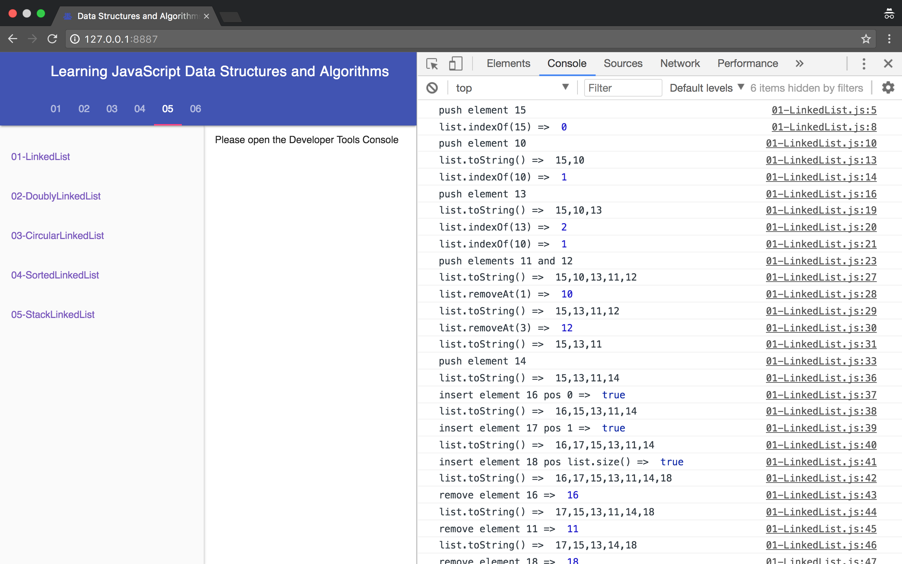

Learning JavaScript Data Structures and Algorithms
====================================

[](https://travis-ci.org/loiane/javascript-datastructures-algorithms)
[](https://codecov.io/gh/loiane/javascript-datastructures-algorithms)
[](https://david-dm.org/loiane/javascript-datastructures-algorithms?type=dev)
[](https://david-dm.org/loiane/javascript-datastructures-algorithms)
[](https://greenkeeper.io/)


Source code of **Learning JavaScript Data Structures and Algorithms** book, third edition.

## List of available chapters:

* 01: [JavaScript: a quick overview](https://github.com/loiane/javascript-datastructures-algorithms/tree/third-edition/examples/chapter01_02)
* 02: [ECMAScript and TypeScript Introduction](https://github.com/loiane/javascript-datastructures-algorithms/tree/third-edition/examples/chapter01_02)
* 03: [Arrays](https://github.com/loiane/javascript-datastructures-algorithms/tree/third-edition/examples/chapter03)
* 04: [Stacks](https://github.com/loiane/javascript-datastructures-algorithms/tree/third-edition/examples/chapter04)
* 05: [Queues and Deques](https://github.com/loiane/javascript-datastructures-algorithms/tree/third-edition/examples/chapter05)
* 06: [LinkedLists](https://github.com/loiane/javascript-datastructures-algorithms/tree/third-edition/examples/chapter06)
* 07: [Sets](https://github.com/loiane/javascript-datastructures-algorithms/tree/third-edition/examples/chapter07)
* 08: [Dictionaries and Hashes](https://github.com/loiane/javascript-datastructures-algorithms/tree/third-edition/examples/chapter08)
* 09: [Recursion](https://github.com/loiane/javascript-datastructures-algorithms/tree/third-edition/examples/chapter09)
* 10: [Trees](https://github.com/loiane/javascript-datastructures-algorithms/tree/third-edition/examples/chapter10)
* 11: [Heap](https://github.com/loiane/javascript-datastructures-algorithms/tree/third-edition/examples/chapter11)
* 12: [Graphs](https://github.com/loiane/javascript-datastructures-algorithms/tree/third-edition/examples/chapter12)
* 13: [Sorting and Searching Algorithms](https://github.com/loiane/javascript-datastructures-algorithms/tree/third-edition/examples/chapter13)
* 14: [Algorithm Design and Techniques](https://github.com/loiane/javascript-datastructures-algorithms/tree/third-edition/examples/chapter14)
* 15: [Algorithm Complexity](https://github.com/loiane/javascript-datastructures-algorithms/tree/third-edition/examples/chapter15)

### Third Edition Updates

* Algorithms using ES2015+ (ES6+)
* New data structures and algorithms
* All chapters rewritten and reviewed 
* Three (3) new chapters
* Creation of a Data Structures and Algorithms library that can be used in the browser or with Node.js
* Algorithms tested with Mocha + Chai (test code available in `test` directory)
* **TypeScript** version of the source code included (library and tests)

## Project Structure

`src/js/index.js` file contains all the data structures and algorithms listed by chapter.

```
|_examples (how to use each data structure and algorithm, organized by chapter)
|_src 
|___js (source code: JavaScript version)
|_____data-structures
|_______models (classes used by DS: Node, ValuePair, ...)
|_____others (other algorithms such as palindome checker, hanoi tower)
|___ts (source code: TypeScript version)
|_____data-structures
|_______models
|_____others
|_test (unit tests with Mocha and Chai for src)
|___js (tests for JavaScript code)
|___ts (tests for TypeScript code)
```

## Installing and running the book examples With Node

* Install [Node](https://nodejs.org)
* Open terminal/cmd and change directory to this project folder: `cd /Users/.../javascript-datastructures-algorithms` (Linux/Max) or `cd C:/.../javascript-datastructures-algorithms`
* run `npm install` to install all dependencies
* To see the examples, run `http-server html` or `npm run serve`. Open your browser `http:\\localhost:8080` to see the book examples
* Or `cd html/chapter01` and run each javascript file with node: `node 02-Variables`

## Running the examples in the browser

* Right click on the html file you would like to see the examples, right click and 'Open with Chrome (or any other browser)'

* Or open the `examples/index.html` file to easily navigate through all examples:

* Demo: [https://javascript-ds-algorithms-book.firebaseapp.com](https://javascript-ds-algorithms-book.firebaseapp.com)



Happy Coding!

## Other editions

| 1st edition   | 2nd edition   | 3rd edition   | 
| ------------- |:-------------:|:-------------:| 
|       |  |  |
| [Book link](http://amzn.to/1Y1OWPx)| [Book link](http://amzn.to/1TSkcA1)| [Book link](http://a.co/cbMlYmJ)|

Book link - first edition:
  - [Packt](https://www.packtpub.com/application-development/learning-javascript-data-structures-and-algorithms)
  - [Amazon](http://amzn.to/1Y1OWPx)
  - [Chinese version](http://www.ituring.com.cn/book/1613)
  - [Korean version](http://www.acornpub.co.kr/book/javascript-data-structure)

Book link - second edition:
 - [Packt](https://www.packtpub.com/web-development/learning-javascript-data-structures-and-algorithms-second-edition)
 - [Amazon](http://amzn.to/1TSkcA1)
 - [Chinese version](http://www.ituring.com.cn/book/2029)
 - [Brazilian Portuguese version](https://novatec.com.br/livros/estruturas-de-dados-algoritmos-em-javascript/)

 Book link - third edition:
 - [Packt](https://www.packtpub.com/web-development/learning-javascript-data-structures-and-algorithms-third-edition)
 - [Amazon](http://a.co/cbMlYmJ)
 - [Chinese version](http://www.ituring.com.cn/book/2653)
 - [Brazilian Portuguese version](https://novatec.com.br/livros/estruturas-de-dados-algoritmos-em-javascript-2ed/)

### Found an issue or have a question?

Please create an [Issue](https://github.com/loiane/javascript-datastructures-algorithms/issues) or [Pull Request](https://github.com/loiane/javascript-datastructures-algorithms/pulls) 
